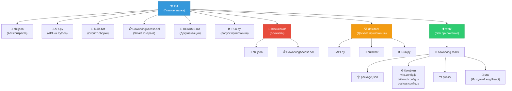
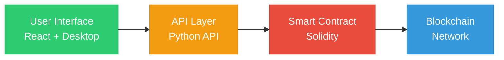

# 📊 Диаграмма архитектуры IoT

## Mermaid диаграмма

## Описание компонентов на диаграмме

### 🔵 IoT (Главная папка)
Центральный узел, содержащий весь проект управления доступом в коворкинг через блокчейн.

### 🔴 blockchain/ (Красный блок)
- **Назначение:** Хранение и управление смарт-контрактом
- **Содержимое:**
  - `abi.json` — интерфейс контракта
  - `CoworkingAccess.sol` — сам контракт

### 🟠 desktop/ (Оранжевый блок)
- **Назначение:** Десктоп приложение на Python
- **Содержимое:**
  - `API.py` — основной API
  - `build.bat` — сборка
  - `Run.py` — запуск

### 🟢 web/ (Зелёный блок)
- **Назначение:** Веб приложение
- **Содержимое:**
  - React приложение с конфигурацией Vite
  - Tailwind CSS для стилизации
  - PostCSS для обработки стилей

---

## Уровни архитектуры

---

*Диаграмма создана: 24.04.2026*
